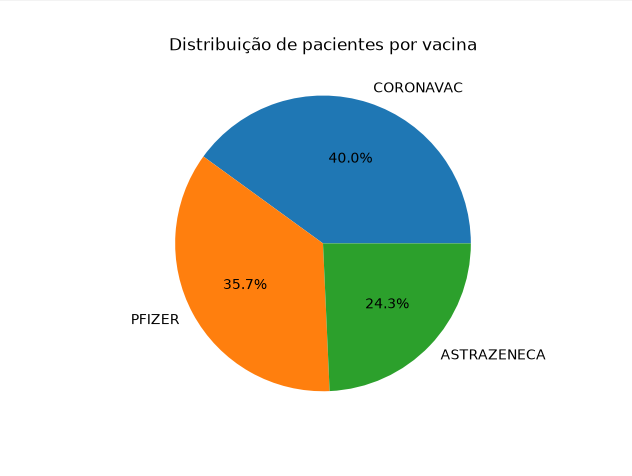
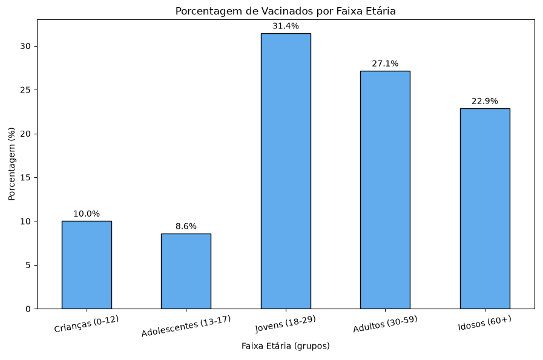

# BigData - Gestão de Saúde Pública

Sistema em Python para cadastro e consulta de pacientes vacinados, com uma etapa inicial de análise de dados (idade e distribuição de vacinas) usando Pandas e Matplotlib.

Projeto acadêmico com foco em manipulação de dados (CSV) e introdução a conceitos de análise de dados aplicados à saúde pública.

## Funcionalidades

O sistema (`Vacinacao.py`) apresenta um painel interativo via terminal com as opções:

1. **Criar Planilha** — gera o arquivo `registro.csv` com o cabeçalho (CPF, Nome, Idade, Data de Nascimento, Sexo, Vacina).
2. **Adicionar Paciente** — cadastra um novo paciente e a vacina aplicada (AstraZeneca, Pfizer ou CoronaVac).
3. **Verificar Pacientes** — lista todos os registros salvos.
4. **Consultar Paciente** — busca um paciente específico pelo CPF.
5. **Análise de informações** — abre um submenu com as análises de dados (veja abaixo).
6. **Finalizar Programa** — encerra a execução.

### Análise de informações (opção 5)

O módulo `AnaliseGrafica.py` concentra a análise exploratória dos dados de `registro.csv`, acessada pelo submenu da opção 5:

1. **Vacina PFIZER** — registro de quem tomou, média de idade e moda de idade dos vacinados.
2. **Vacina CORONAVAC** — registro de quem tomou, média de idade e moda de idade dos vacinados.
3. **Vacina ASTRAZENECA** — registro de quem tomou, média de idade e moda de idade dos vacinados.
4. **Comparativo entre as 3 vacinas** — gráfico de pizza com a distribuição percentual de pacientes por vacina aplicada.
5. **Porcentagem de vacinados por faixa etária** — gráfico de barras com o percentual de vacinados em cada faixa (Crianças, Adolescentes, Jovens, Adultos e Idosos), calculada a partir da data de nascimento.

#### Distribuição de pacientes por vacina



#### Porcentagem de vacinados por faixa etária




## Estrutura do projeto

```
BigData-GestaoSaudePublica/
├── Vacinacao.py         # Painel principal (menu do sistema)
├── funcoes.py           # Funções de cadastro, consulta e listagem de pacientes
├── AnaliseGrafica.py    # Análise exploratória e gráficos com Pandas/Matplotlib
├── registro.csv         # Base de dados dos pacientes (gerada/usada pelo sistema)
├── txt/
│   └── conteudos.txt    # Backup do conteúdo de registro.csv
└── requeriments.txt     # Dependências do projeto
|
└── assets/
      └── graficos(imagem)
```

## Tecnologias utilizadas

- Python 3
- [pandas](https://pandas.pydata.org/) — manipulação e análise dos dados
- [matplotlib](https://matplotlib.org/) — geração de gráficos
- Módulo `csv` da biblioteca padrão — leitura/escrita do registro de pacientes

## Como executar

1. Clone o repositório:

   ```bash
   git clone https://github.com/JordanAguiar/BigData-GestaoSaudePublica.git
   cd BigData-GestaoSaudePublica
   ```

2. Instale as dependências:

   ```bash
   pip install -r requeriments.txt
   ```

3. Execute o sistema:

   ```bash
   python Vacinacao.py
   ```

4. No painel, use as opções 1-4 para cadastrar e consultar pacientes, e a opção 5 para acessar o submenu de análise de dados (gráficos e estatísticas por vacina).

## Licença
Este projeto está sob a licença [MIT](LICENSE) — sinta-se livre para usar, estudar, e adaptar o código, mantendo os devidos créditos.

## Autores

Desenvolvido por [Jordan Aguiar](https://github.com/JordanAguiar), [Alice Lima](https://github.com/alice-estudante) e [Igor Lyra](https://github.com/Igotkun)  

